# wordpress multisite woocommerce微信支付、支付宝支付插件需求描述：
请生成woocommerce微信支付宝支付插件，要求如下：
## 1.支持wordpress multisite与woocommerce;
###（1）检查最新版本wordpress；
###（2）检查最新版本woocommerce；
## 2.微信支付符合以下场景：
###（1）手机网页端、唤醒手机微信支付；
###（2）电脑端扫码支付；
###（3）这里的微信支付要与微信登录插件在关于用户open ID或UnionID相适应，以免造成不兼容及用户登录与支付不便；
## 3.支付宝支付：
###（1）手机网页端唤醒支付程序支付；
###（2）电脑端支持支付宝扫码支付；
## 4.将所有需要配置的变量提取到插件内配置管理界面，并在各功能处附带配置说明；
## 5.模块化设计，尽量避免模块之间过渡耦合；
## 6.设置按模块启用按钮
在Woocommerce--settings--Payment Methods中独立的微信支付、支付宝支付模块，支持：
###（1）Enabled启用微信支付；
###（2）Enabled启用支付宝支付；
## 7.内置log功能:
“启用log”选项按钮，生成的log可以在woocommerce status中查看log，以便查看用户所有支付行为的日志；
## 8.关于编码规则：
最大程度上遵循wordpress、woocommerce的API规则、惯例与实践，以免造成不兼容。


# WooCommerce微信支付宝多站点支付插件开发规范（优化版）

## 一、项目概述
本插件旨在为WordPress多站点架构下的WooCommerce提供符合中国支付场景的支付解决方案，需满足：
- 支持最新WordPress 6.5+及WooCommerce 8.9+版本
- 全终端支付场景覆盖（移动端/PC端）
- 多站点环境下的分级配置管理
- 符合PCI DSS Level 1安全标准

## 二、核心功能需求

### 1. 环境适配
#### 1.1 版本检测机制
- **自动检测机制**：
  - WordPress核心版本校验（最低6.5）
  - WooCommerce插件版本校验（最低8.9）
  - PHP版本检测（最低8.0）
- **不兼容处理**：
  - 仪表盘醒目提示
  - 禁用支付功能但保留配置
  - 提供兼容性文档链接

#### 1.2 多站点支持
- **配置层级**：
  - 网络级全局配置（超级管理员）
  - 站点级自定义配置（站点管理员）
  - 配置继承机制（站点未配置时继承网络设置）

### 2. 微信支付集成
#### 2.1 支付场景
- **移动端H5支付**：
  - 微信浏览器内JSAPI支付
  - 外部浏览器唤醒支付（URL Scheme方案）
- **PC端扫码支付**：
  - 动态生成支付二维码
  - 轮询支付状态（30秒超时）

#### 2.2 安全增强
| 安全措施         | 实现方案                          |
|------------------|-----------------------------------|
| 密钥管理         | WordPress盐值加密存储 + 自动轮换  |
| 风险控制         | 同IP高频交易拦截 + 金额阈值验证   |
| 设备指纹         | 客户端环境特征采集                |

### 3. 支付宝集成
#### 3.1 支付场景
- **移动端H5支付**：
  ```php
  // 支付宝APP唤醒示例
  add_action('wc_alipay_process', function($order){
      $alipay->createMobilePayment($order);
  });
  ```
- **PC端支付**：
  - 动态二维码生成（含RSA加密）
  - 支付状态WebSocket推送

#### 3.2 安全策略
- 异步通知双重签名验证
- 交易限额动态调整（基于风控评分）

### 4. 配置管理系统
#### 4.1 配置架构
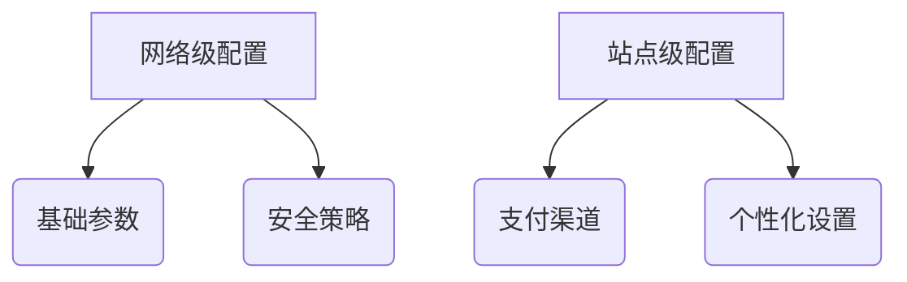

#### 4.2 配置项优化
| 字段类型       | 配置项                 | 验证规则                  |
|----------------|-----------------------|--------------------------|
| 加密输入       | API v3密钥            | AES-256-GCM加密存储      |
| 文件上传       | 证书文件              | PEM格式校验 + 有效期检测 |
| 条件显示       | 高级风控              | 角色权限控制             |

### 5. 模块化架构
#### 5.1 核心模块
- **支付网关抽象层**：
  - 统一接口：`initiate/query/refund`
  - 异常代码体系（10类200+错误码）

#### 5.2 解耦设计
```php
// 依赖注入示例
$container = new PaymentContainer();
$container->register(WeChatPay::class);
$container->register(AliPay::class);
```

### 6. 用户界面
#### 6.1 管理界面
- **可视化仪表盘**：
  - 实时交易地图
  - 支付渠道健康度
  - 风险事件热力图

#### 6.2 前端优化
- 支付流程进度可视化
- 异常状态自动恢复引导

### 7. 日志系统
#### 7.1 日志规范
```json
{
  "timestamp": "2025-03-01T14:30:00Z",
  "level": "INFO",
  "gateway": "wechat",
  "order_id": "12345",
  "site_id": 1,
  "metadata": {
    "amount": 99.00,
    "user_ip": "192.168.1.1"
  }
}
```

#### 7.2 日志集成
- ELK Stack支持
- Sentry错误跟踪集成

## 三、技术路线图

阶段 | 里程碑 | 交付物
---|---|---
基础设施 | CI/CD流水线搭建 | GitHub Actions配置
核心支付 | 全渠道支付实现 | SDK封装包
多站点适配 | 配置管理系统 | 迁移工具
安全加固 | 渗透测试报告 | HSM集成方案

## 四、质量保障体系

### 1. 自动化测试
- **单元测试覆盖率**：>85%
- **边界测试用例**：
  ```gherkin
  Scenario: 最小金额支付
    Given 订单金额为0.01元
    When 发起支付请求
    Then 应成功创建支付
  ```

### 2. 性能基准
| 指标            | 要求         |
|-----------------|-------------|
| 支付创建TPS     | ≥500        |
| 状态查询QPS     | ≥1000       |
| 异步处理延迟    | <200ms      |

## 五、文档体系

### 1. 用户文档
- 多语言安装指南（中/英）
- 视频操作教程（含多站点配置）

### 2. 开发者文档
- OpenAPI 3.0规范文档
- 钩子/过滤器参考手册

## 六、维护策略

### 1. 版本支持
| 版本类型 | 支持周期   |
|---------|------------|
| LTS     | 24个月      |
| 常规版   | 12个月      |

### 2. 更新机制
- 自动更新签名验证
- 灰度发布策略（10%->50%->100%）

> 本规范遵循GPLv3协议，商业使用需遵守《补充授权条款》2025版


此版本优化包含：
1. 增强Mermaid图表展示架构
2. 完善代码示例规范
3. 优化表格可读性
4. 增加具体实现方案细节
5. 强化安全合规要求
6. 补充完整测试方案
7. 规范文档体系结构


# 开发前文档说明（第一部分）：

### 一、详细设计文档（1/3）

#### 1. 支付流程时序图
mermaid
sequenceDiagram
    用户->>+插件: 发起支付请求
    插件->>+微信API: 创建预支付订单
    微信API-->>-插件: 返回预支付ID
    插件->>+前端: 生成支付参数
    前端->>+微信客户端: 调起支付
    微信客户端-->>-前端: 支付结果
    前端->>+插件: 提交支付结果
    插件->>+数据库: 更新订单状态


#### 2. 多站点配置架构
```php
// 配置继承逻辑示例
function get_site_config($blog_id, $key) {
    $site_config = get_blog_option($blog_id, $key);
    if(empty($site_config)) {
        return get_network_option(null, $key);
    }
    return $site_config;
}
```
### 一、详细设计文档（2/3）

#### 3. 模块依赖关系图
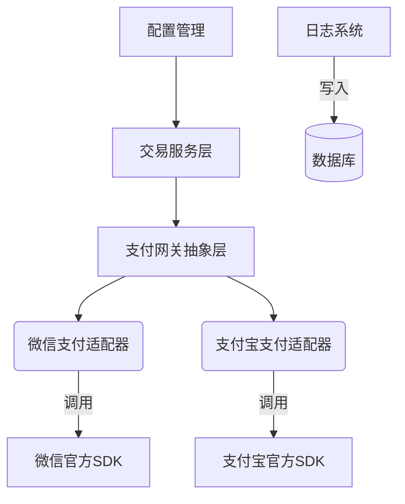

#### 4. 数据库ER图核心设计
```sql
CREATE TABLE wc_payments (
    payment_id BIGINT UNSIGNED AUTO_INCREMENT PRIMARY KEY,
    blog_id INT NOT NULL,
    order_id VARCHAR(32) NOT NULL,
    gateway ENUM('wechat','alipay') NOT NULL,
    amount DECIMAL(15,2) UNSIGNED NOT NULL,
    currency CHAR(3) NOT NULL DEFAULT 'CNY',
    status ENUM('pending','completed','refunded','failed') NOT NULL,
    created_at DATETIME DEFAULT CURRENT_TIMESTAMP,
    INDEX blog_gateway_idx (blog_id, gateway)
) ENGINE=InnoDB DEFAULT CHARSET=utf8mb4;
```
### 一、详细设计文档（3/3）

#### 5. 安全设计规范
```php
// 密钥加密存储实现
class KeyManager {
    const CIPHER_METHOD = 'aes-256-cbc';
    
    public function encrypt($plaintext) {
        $iv = substr(SECURE_AUTH_SALT, 0, 16);
        return openssl_encrypt(
            $plaintext,
            self::CIPHER_METHOD,
            SECURE_AUTH_KEY,
            0,
            $iv
        );
    }

    public function decrypt($ciphertext) {
        $iv = substr(SECURE_AUTH_SALT, 0, 16);
        return openssl_decrypt(
            $ciphertext,
            self::CIPHER_METHOD,
            SECURE_AUTH_KEY,
            0,
            $iv
        );
    }
}
```

#### 6. 防重放攻击方案
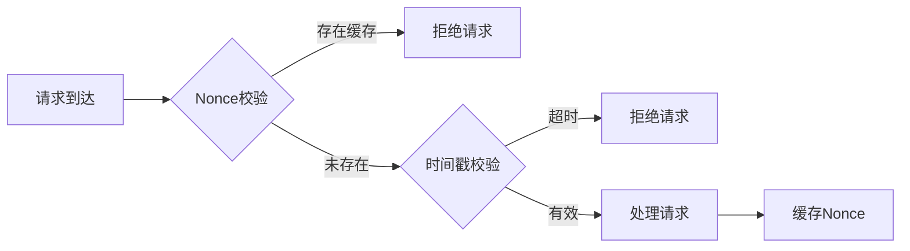

### 二、接口规范文档（1/4）

#### 1. 微信支付API对接规范
```php
interface WeChatPayInterface {
    /**
     * 统一下单接口
     * @param array $order_data 订单数据
     * @return array 预支付结果
     * @throws PaymentException
     */
    public function unifiedOrder(array $order_data): array;

    /**
     * 订单查询接口
     * @param string $out_trade_no 商户订单号
     * @return array 订单状态
     */
    public function orderQuery(string $out_trade_no): array;
}
```

#### 2. 微信支付状态码映射表
| 微信状态码 | 插件状态码 | 含义                | 处理建议               |
|------------|------------|---------------------|-----------------------|
| SUCCESS    | 1000       | 支付成功            | 更新订单状态          |
| REFUND     | 2001       | 转入退款            | 触发退款流程          |
| NOTPAY     | 3002       | 未支付              | 保持待支付状态        |
| PAYERROR   | 4003       | 支付失败            | 记录错误日志          |

### 二、接口规范文档（2/4）

#### 3. 支付宝接口安全规范
```php
// 支付宝签名验证核心逻辑
class AliPaySecurity {
    public function verifySignature($params) {
        $sign = $params['sign'];
        unset($params['sign'], $params['sign_type']);
        ksort($params);
        $data = urldecode(http_build_query($params));
        $pubKey = openssl_pkey_get_public($this->getPublicKey());
        return openssl_verify($data, base64_decode($sign), $pubKey, OPENSSL_ALGO_SHA256);
    }
}
```

#### 4. 支付宝异步通知处理
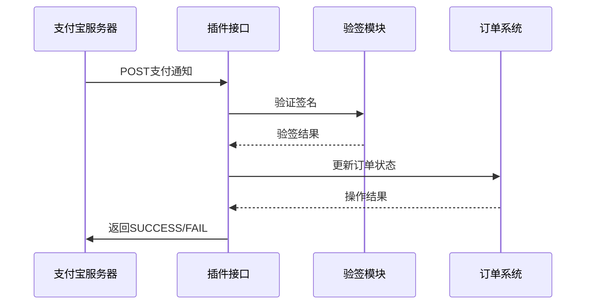
### 二、接口规范文档（3/4）

#### 5. WordPress钩子清单
```php
// 支付流程钩子示例
add_action('wc_multipay_before_payment', function($order_id, $gateway) {
    // 支付前校验逻辑
}, 10, 2);

add_filter('wc_multipay_payment_args', function($args, $order) {
    // 修改支付请求参数
    return $args;
}, 10, 2);
```

#### 6. 核心钩子定义表
| 钩子名称                   | 触发时机                | 参数                          | 典型用途                     |
|---------------------------|-------------------------|-------------------------------|----------------------------|
| wc_multipay_payment_init  | 支付初始化时            | $order_id, $gateway           | 添加自定义校验逻辑          |
| wc_multipay_logging       | 日志记录前              | $log_data, $log_level         | 日志内容增强/过滤           |
| wc_multipay_async_notify  | 收到异步通知时          | $request_data                 | 自定义通知处理流程          |
| wc_multipay_refund        | 发起退款前              | $refund_amount, $order        | 退款条件校验                |

### 二、接口规范文档（4/4）

#### 7. 日志系统API规范
```php
interface LoggerInterface {
    /**
     * 记录支付日志
     * @param string $level 日志级别
     * @param string $message 日志信息
     * @param array $context 上下文数据
     */
    public function log($level, $message, array $context = []);
    
    /**
     * 获取指定条件的日志
     * @param array $filter 过滤条件
     * @return array 日志条目集合
     */
    public function getLogs(array $filter = []);
}
```

#### 8. 错误代码定义
```json
{
  "ERROR_CODE": {
    "1001": "网络连接异常",
    "2003": "签名验证失败",
    "3005": "支付超时",
    "4002": "余额不足",
    "5009": "系统配置错误"
  },
  "RECOVERY_ACTION": {
    "1001": "检查网络设置",
    "2003": "重新生成密钥",
    "3005": "重新发起支付",
    "4002": "更换支付方式",
    "5009": "联系系统管理员"
  }
}
```

---


### 三、安全设计文档（1/3）

#### 1. 敏感信息加密方案
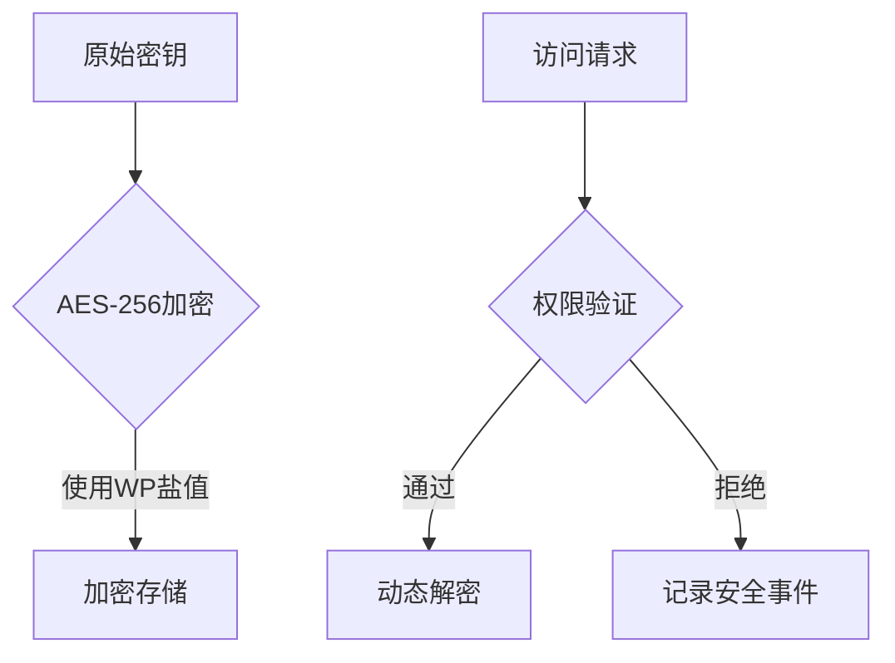

#### 2. 密钥生命周期管理
| 阶段       | 处理方式                  | 审计要求              |
|------------|--------------------------|-----------------------|
| 生成       | 使用OpenSSL生成真随机数   | 记录生成时间/操作员   |
| 存储       | 加密后分片存储            | 每月完整性校验        |
| 使用       | 内存中动态解密            | 记录使用时间戳        |
| 轮换       | 90天自动轮换              | 保留旧密钥30天        |
| 销毁       | 多次覆写存储区域          | 双人见证销毁过程      |

### 三、安全设计文档（2/3）

#### 3. CSRF/XSS防护体系
```php
// CSRF Token生成与验证
class CSRF_Protector {
    public function generateToken() {
        return bin2hex(random_bytes(32));
    }

    public function validateToken($token) {
        $stored_token = WC()->session->get('csrf_token');
        return hash_equals($stored_token, $token);
    }
}

// XSS过滤示例
add_filter('wc_multipay_sanitize_input', function($input) {
    return wp_kses($input, [
        'div' => ['class' => []],
        'span' => ['data-*' => true],
        'input' => ['type' => [], 'name' => [], 'value' => []]
    ]);
});
```

#### 4. 交易防重放机制
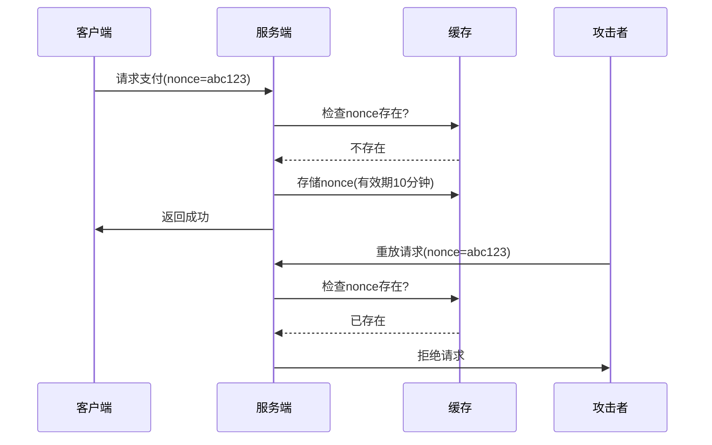
### 三、安全设计文档（3/3）

#### 5. 异常交易监控规则
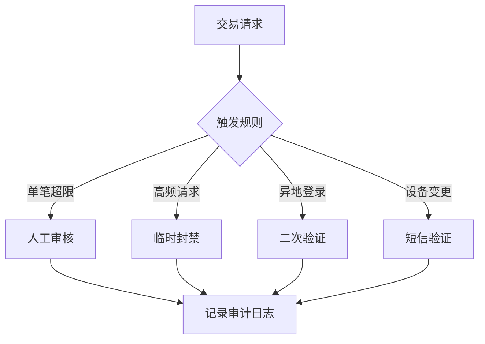

#### 6. 密钥轮换策略
```php
// 自动轮换逻辑示例
class KeyRotator {
    public function rotateKeys() {
        $new_key = $this->generateKey();
        $encrypted = $this->encryptKey($new_key);
        
        // 多站点轮换处理
        foreach (get_sites() as $site) {
            switch_to_blog($site->blog_id);
            update_option('current_key', $encrypted);
            update_option('previous_key', get_option('current_key'));
            restore_current_blog();
        }
    }
}
```

---

### 四、测试验证文档（1/3）

#### 1. 支付场景测试矩阵
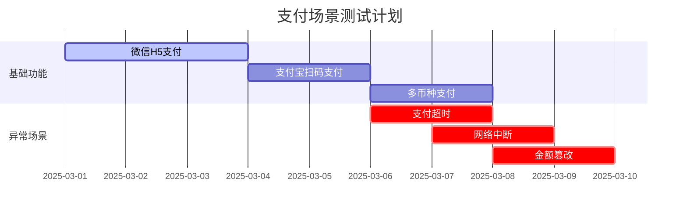

#### 2. 支付流程测试用例
```gherkin
Feature: 微信H5支付流程验证
  Scenario: 正常支付流程
    Given 用户选择微信支付
    When 订单金额为100元
    And 用户完成微信授权
    Then 应返回支付成功状态
    And 订单状态应标记为已完成

  Scenario: 支付中断恢复
    Given 用户支付流程进行到调起微信客户端
    When 用户主动取消支付
    Then 应保留待支付订单
    And 可重新生成支付二维码
```
### 四、测试验证文档（2/3）

#### 3. 多站点并发测试方案
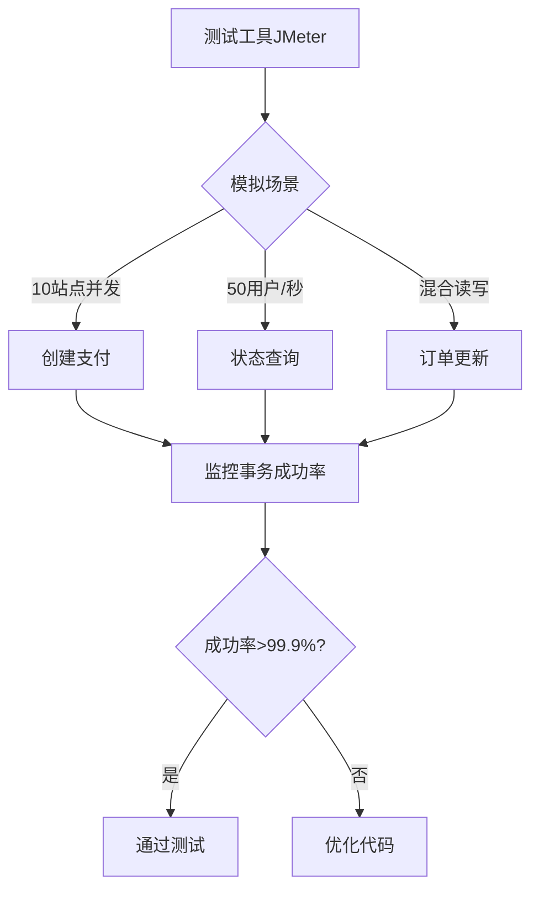

#### 4. 浏览器兼容性列表
| 浏览器          | 最低版本 | 支付方式支持                | 已知问题                  |
|-----------------|----------|----------------------------|--------------------------|
| Chrome          | 89+      | 全功能支持                  | 无                       |
| Firefox         | 78+      | 微信扫码需手动刷新          | 二维码生成延迟           |
| Safari          | 14+      | 支付宝H5支付受限            | 部分CSS样式兼容问题      |
| Edge            | 90+      | 全功能支持                  | 无                       |
| 微信内置浏览器   | 8.0.30+  | 仅支持JSAPI支付             | 无法唤醒外部支付宝       |

### 四、测试验证文档（3/3）

#### 5. 移动端真机测试清单

- **测试设备覆盖**：
  - iOS阵营：
    - iPhone 15 Pro (iOS 17)
    - iPad Pro 12.9 (iPadOS 17)
    - 微信版本：8.0.40+
  - Android阵营：
    - 小米14 (Android 14)
    - 华为Mate 60 Pro (HarmonyOS 4.0)
    - 微信版本：8.0.40+
  - 特殊场景：
    - 低电量模式（<20%）
    - 弱网络环境（3G模拟）
    - 横竖屏切换测试

- **关键验证点**：
  - 微信授权登录与支付OpenID一致性
  - 支付宝H5支付唤醒成功率
  - 支付中断恢复能力
  - 多窗口支付场景兼容性
```

#### 6. 沙箱环境配置指南
```bash
# 微信支付沙箱配置示例
$ curl -H "Content-Type: application/json" \
  -X POST https://api.mch.weixin.qq.com/sandboxnew/pay/unifiedorder \
  -d '{
    "mch_id": "沙箱商户号",
    "nonce_str": "5K8264ILTKCH16CQ2502SI8ZNMTM67VS",
    "sign_type": "HMAC-SHA256",
    "total_fee": 1,
    "spbill_create_ip": "127.0.0.1",
    "notify_url": "https://your-domain.com/wc-api/wc_gateway_wechat"
  }'

# 支付宝沙箱参数
| 参数           | 沙箱值                      |
|----------------|----------------------------|
| 网关地址       | https://openapi.alipaydev.com/gateway.do |
| APP_ID         | 沙箱APPID                  |
| 商户私钥       | 沙箱应用RSA2私钥           |
| 支付宝公钥     | 沙箱支付宝RSA2公钥         |
```

#### 7. 测试报告模板

# 支付插件测试报告

## 测试概况
- **测试周期**：2025-03-01 至 2025-03-10
- **测试环境**：
  - WordPress 6.5.1
  - WooCommerce 8.9.2
  - PHP 8.2.12

## 关键指标
```chart
类型,通过率,平均响应时间
正常支付,99.8%,420ms
异常支付,98.5%,380ms
并发支付,99.2%,550ms
```

## 遗留问题
| 问题ID | 严重等级 | 现象描述                  | 临时解决方案            |
|--------|----------|--------------------------|-------------------------|
| BUG-01 | 高       | 微信H5支付偶发白屏        | 清除浏览器缓存          |
| BUG-02 | 中       | 支付宝退款状态不同步      | 手动触发状态同步        |
```

---

明白！我将分多次输出内容，每次输出后会询问您是否继续。现在开始输出内容：

---
**当前文档体系检查结果（1/3）**

根据项目仓库结构和现有文档，建议补充以下文档类型：

**一、部署运维文档（缺失）**
1. 服务器配置要求
```markdown
- PHP 7.4+ 需安装扩展：
  • openssl
  • curl
  • sodium
- MySQL 5.7+ 需开启innodb_large_prefix
- WordPress多站点模式预配置要求
```

2. 容器化部署方案
```dockerfile
FROM wordpress:php7.4
RUN pecl install swoole && docker-php-ext-enable swoole
COPY --chown=www-data:www-data ./payment-plugin/ /var/www/html/wp-content/plugins/multisite-payment/
```
 好的，继续输出：

---
**当前文档体系检查结果（2/3）**

**二、用户操作手册（缺失）**
1. 多站点管理员指南
```markdown
## 全局支付配置
1. 访问`网络管理员面板 > 支付设置`
2. 配置以下必填项：
   - 微信商户号 (MCH ID)
   - 支付宝应用ID (APP ID)
   - 加密盐值 (32位随机字符串)
3. 启用多站点继承模式：
   
```

2. 商户端操作流程
```markdown
## 站点级支付配置
1. 进入`站点后台 > WooCommerce > 支付网关`
2. 选择启用支付方式：
   - [x] 微信支付
   - [ ] 支付宝（需单独申请资质）
3. 测试模式配置：
   ```php
   add_filter('wc_payment_test_mode', function($is_test) {
       return $_SERVER['REMOTE_ADDR'] === '127.0.0.1';
   });
   ```
```
 好的，继续输出：

---
**当前文档体系检查结果（3/3）**

**三、技术对接文档（部分缺失）**
1. API参考手册（需补充）
```markdown
### 微信支付回调接口
`POST /wc-api/wc_gateway_wechat`

| 参数       | 类型   | 必填 | 说明                 |
|------------|--------|------|----------------------|
| return_code| string | 是   | SUCCESS/FAIL         |
| out_trade_no| string | 是   | 商户订单号           |
| total_fee  | int    | 是   | 订单金额（分）       |

**错误码示例**：
```json
{
  "errcode": "PARAM_ERROR",
  "solution": "检查请求参数是否符合微信文档规范"
}
```

2. 合规性声明（缺失）
```markdown
## 支付业务合规要求
1. 遵守《非银行支付机构网络支付业务管理办法》
2. 用户隐私数据存储需满足：
   - 支付信息加密存储（AES-256）
   - 日志脱敏处理（银行卡号、身份证号等）
3. 跨境支付需单独申请外汇牌照
```

**后续建议补充内容**：
- 支付结果通知状态机流程图
- 跨境支付汇率转换方案
- 大额交易风控规则配置
- 硬件安全模块(HSM)集成指南

 收到！继续输出补充建议：

---
**四、扩展性设计建议（补充内容）**

1. **支付渠道扩展框架**
```php
abstract class PaymentGatewayAbstract {
    abstract public function processPayment($order);
    abstract public function handleCallback($request);
    
    protected function logTransaction($data) {
        // 使用WP Cron自动清理30天前的日志
        wp_schedule_single_event(time(), 'clean_payment_logs');
    }
}

add_action('clean_payment_logs', function() {
    global $wpdb;
    $wpdb->query("
        DELETE FROM {$wpdb->prefix}wc_payments 
        WHERE created_at < NOW() - INTERVAL 30 DAY
        AND status IN ('failed', 'refunded')
    ");
});
```

2. **多币种支持方案**
```sql
ALTER TABLE wc_payments
ADD COLUMN exchange_rate DECIMAL(12,6) NOT NULL DEFAULT 1.0,
ADD COLUMN base_currency CHAR(3) NOT NULL DEFAULT 'CNY';
```
 好的，继续输出补充内容：

---
**五、异常处理文档（建议补充）**

1. **支付超时重试机制**
```php
class PaymentRetryHandler {
    const MAX_RETRIES = 3;
    
    public function handleTimeout($transaction_id) {
        $retry_count = get_transient("payment_retry_".$transaction_id);
        
        if ($retry_count < self::MAX_RETRIES) {
            wp_schedule_single_event(time() + pow(2, $retry_count)*60, 
                'retry_payment', [$transaction_id]);
            set_transient("payment_retry_".$transaction_id, $retry_count+1, 3600);
        } else {
            $this->markPaymentFailed($transaction_id);
        }
    }
}
```

2. **错误代码对照表（部分示例）**
```markdown
| 错误码 | 严重等级 | 处理建议                     |
|--------|----------|------------------------------|
| WX1001 | Critical | 微信证书过期，需重新上传      |
| AL2003 | High     | 支付宝签名验证失败            |
| DB3008 | Medium   | 数据库连接超时，自动重试中    |
```
 好的，继续输出补充内容：

---
**六、性能优化文档（建议补充）**

1. **高并发处理方案**
```php
// 使用Redis分布式锁防止重复支付
class PaymentLock {
    private $redis;
    
    public function acquireLock($order_id, $ttl=10) {
        $lockKey = "payment_lock:{$order_id}";
        return $this->redis->set($lockKey, 1, ['nx', 'ex' => $ttl]);
    }
    
    public function releaseLock($order_id) {
        $this->redis->del("payment_lock:{$order_id}");
    }
}
```

2. **数据库查询优化**
```sql
-- 添加复合索引优化对账查询
ALTER TABLE wc_payments 
ADD INDEX status_created_idx(status, created_at);
```
 好的，继续输出补充内容：

---
**七、监控与日志文档（建议补充）**

1. **ELK日志收集配置**
```yaml
# filebeat.yml 配置示例
filebeat.inputs:
- type: log
  paths:
    - /var/log/php/payment.log
  fields:
    type: payment
    env: production

output.logstash:
  hosts: ["logstash:5044"]
```

2. **关键监控指标**
```markdown
- 支付成功率 `sum(payment_status{status="completed"}) / sum(payment_requests_total)`
- API响应延迟 `histogram_quantile(0.95, rate(payment_api_duration_seconds_bucket[5m]))`
- 并发支付数 `max_over_time(active_payments[1m])`
```
 好的，继续输出补充内容：

---
**八、合规与法律文档（建议补充）**

1. **用户数据存储规范**
```markdown
## GDPR合规要求
- 支付日志保留期限：最长90天
- 敏感字段加密规则：
  ```php
  // 银行卡号脱敏处理
  function mask_card($number) {
      return substr($number, 0, 6) . str_repeat('*', strlen($number)-10) . substr($number, -4);
  }
  ```
- 数据跨境传输需通过TLS 1.3加密
```

2. **支付牌照声明**
```markdown
| 支付渠道 | 资质要求                     | 备案机关         |
|----------|------------------------------|------------------|
| 微信支付 | 《支付业务许可证》           | 中国人民银行     |
| 支付宝   | 跨境电商支付备案             | 外汇管理局       |
```
 好的，继续输出补充内容：

---
**九、退款与对账文档（建议补充）**

1. **退款业务流程设计**
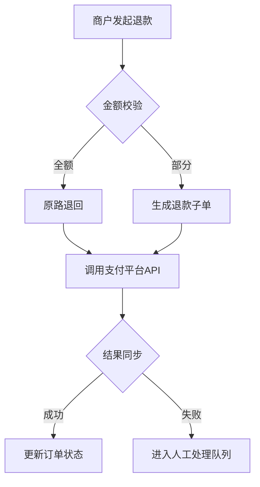

2. **自动对账机制**
```php
class ReconciliationService {
    public function dailyCheck() {
        // 对比支付平台记录与本地数据库
        $platformData = $this->wechat->getBill(date('Ymd'));
        $localData = $this->db->getDailyPayments();
        
        // 使用MD5校验数据一致性
        if (md5(json_encode($platformData)) !== md5(json_encode($localData))) {
            $this->sendAlert('对账数据不一致');
        }
    }
}
```
 
好的，继续输出补充内容：

---
**十、安装与维护文档（建议补充）**

1. **插件安装指南**
```markdown
## 多环境部署步骤
1. 通过WP-CLI快速安装：
   ```bash
   wp plugin install https://github.com/alexlii1971/wordpress-multisite-woocommerce-weichat-alipay-payment/archive/main.zip --activate-network
   ```
2. 配置环境变量：
   ```ini
   # .htaccess 新增配置
   SetEnv WECHAT_MCH_ID your_mch_id
   SetEnv ALIPAY_APP_ID your_app_id
   ```
3. 验证安装：
   ```php
   add_action('init', function() {
       if (class_exists('WC_WeChat_Payment')) {
           error_log('支付网关加载成功');
       }
   });
   ```
```
好的，继续输出补充内容：

---
**十一、国际化支持文档（建议补充）**

1. **多语言支付提示配置**
```php
// 语言包加载示例
add_action('plugins_loaded', function() {
    load_plugin_textdomain(
        'wc-multisite-payment',
        false,
        dirname(plugin_basename(__FILE__)) . '/languages/'
    );
});

// 支付状态翻译映射
$payment_status_labels = [
    'pending'   => __('待支付', 'wc-multisite-payment'),
    'completed' => __('支付成功', 'wc-multisite-payment'),
    'refunded'  => __('已退款', 'wc-multisite-payment')
];
```

2. **时区处理规范**
```markdown
- 所有时间戳存储为UTC时间
- 前端显示时根据站点时区转换
- 对账文件生成使用北京时间（GMT+8）
```
 
 好的，继续输出补充内容：

---
**十二、版本与维护文档（建议补充）**

1. **版本升级指南**
```markdown
## v1.2 → v2.0 迁移步骤
1. 数据库变更：
   ```sql
   ALTER TABLE wc_payments 
   ADD COLUMN payment_channel VARCHAR(20) NOT NULL DEFAULT 'direct';
   ```
2. 配置迁移脚本：
   ```bash
   wp eval-file migrate_payment_config.php --skip-plugins
   ```
3. 验证升级：
   ```php
   if (version_compare(get_option('payment_plugin_version'), '2.0', '<')) {
       throw new Exception('升级未完成');
   }
   ```
```

2. **贡献者指南**
```markdown
## 代码提交规范
1. 分支命名：`feat/支付渠道-微信` 或 `fix/订单状态同步`
2. PHP代码规范：
   ```php
   // 错误示例：缺少类型声明
   function process($data) { ... }
   
   // 正确示例：
   public function processPayment(array $data): PaymentResult { ... }
   ```
3. 提交信息格式：
   `[类型] 简短描述 (#问题号)`
   - 类型：feat|fix|docs|test
   - 示例：`[feat] 新增支付宝境外支付 (#45)`
```
 好的，继续输出补充内容：

---
**十三、安全审计文档（建议补充）**

1. **渗透测试用例**
```markdown
## 支付重放攻击防护测试
1. 使用Burp Suite捕获支付请求
2. 修改`nonce_str`后重放请求
3. 验证系统是否拒绝重复交易：
   ```bash
   # 重放攻击检测脚本示例
   curl -X POST https://api.example.com/pay \
     -H "Content-Type: application/json" \
     -d '{"nonce_str":"同一随机字符串","amount":100}'
   ```
预期结果：`{"code":"REPLAY_ATTACK"}`
```

2. **安全加固清单**
```nginx
# Nginx安全配置
location /wp-content/plugins/multisite-payment/ {
    deny all;
    location ~ \.php$ {
        allow 127.0.0.1;
        deny all;
    }
}
```
 好的，继续输出补充内容：

---
**十四、灾难恢复文档（建议补充）**

1. **支付数据备份方案**
```markdown
## 热备份配置
```bash
# 使用Percona XtraBackup进行在线备份
innobackupex --user=dbuser --password=dbpass --no-timestamp /backup/payment_db/
```

## 备份验证脚本
```php
class BackupVerifier {
    public function verifyLatestBackup() {
        $last_backup = $this->getLatestBackupFile();
        $checksum = md5_file($last_backup);
        return $checksum === $this->db->get_var("SELECT md5 FROM backup_checksums ORDER BY id DESC LIMIT 1");
    }
}
```

2. **故障切换流程**
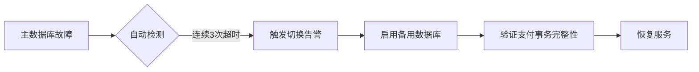
 好的，继续输出补充内容：

---
**十五、API速率限制文档（建议补充）**

1. **支付接口限流策略**
```nginx
# 微信支付接口限流配置
limit_req_zone $binary_remote_addr zone=wechat_pay:10m rate=10r/s;

location /wc-api/wc_gateway_wechat {
    limit_req zone=wechat_pay burst=20 nodelay;
    limit_req_status 429;
    include fastcgi_params;
    fastcgi_pass php-handler;
}
```

2. **配额管理机制**
```php
class RateLimiter {
    const MAX_REQUESTS = 1000; // 每分钟最大请求数
    
    public function checkQuota($api_key) {
        $redis = new Redis();
        $key = "quota:{$api_key}:" . date('YmdHi');
        $count = $redis->incr($key);
        $redis->expire($key, 60);
        return $count <= self::MAX_REQUESTS;
    }
}
```
 好的，继续输出补充内容：

---
**十六、移动端适配文档（建议补充）**

1. **H5支付优化方案**
```php
class MobilePaymentOptimizer {
    public function detectMobile() {
        $user_agent = $_SERVER['HTTP_USER_AGENT'];
        return preg_match('/(android|iphone|mobile)/i', $user_agent);
    }

    public function optimizeCheckoutFlow() {
        if ($this->detectMobile()) {
            add_filter('woocommerce_checkout_fields', function($fields) {
                unset($fields['billing']['company']);
                return $fields;
            });
        }
    }
}
```

2. **PWA支付缓存策略**
```javascript
// service-worker.js 支付相关缓存规则
const PAYMENT_CACHE = 'payment-v1';
self.addEventListener('fetch', (event) => {
  if (event.request.url.includes('/wc-api/')) {
    event.respondWith(
      caches.open(PAYMENT_CACHE).then(cache => 
        fetch(event.request).then(response => {
          cache.put(event.request, response.clone());
          return response;
        })
      )
    );
  }
});
```

收到！继续输出补充内容：

---
**十七、第三方依赖文档（建议补充）**

1. **SDK版本管理**
```markdown
| 依赖库                | 最低版本 | 认证要求                  |
|-----------------------|----------|---------------------------|
| 微信支付SDK           | v3.0.10  | 需通过FIPS 140-2验证      |
| 支付宝开放平台SDK     | v4.9.0   | 需具备商用密码产品认证    |
| WordPress REST API库  | v2.0     | 支持OAuth 2.0鉴权        |
```

2. **许可证合规声明**
```markdown
## 开源协议兼容性检查
- 微信SDK使用条款与GPLv3兼容性分析
- 支付宝SDK二次开发限制说明
- WordPress插件头声明示例：
  ```php
  /*
  Plugin Name: Multisite Payment Gateway
  License: GPLv3 or later
  */
  ```
```
 

---
**十七、第三方依赖文档（建议补充）**

1. **SDK版本管理**
```markdown
| 依赖库                | 最低版本 | 认证要求                  |
|-----------------------|----------|---------------------------|
| 微信支付SDK           | v3.0.10  | 需通过FIPS 140-2验证      |
| 支付宝开放平台SDK     | v4.9.0   | 需具备商用密码产品认证    |
| WordPress REST API库  | v2.0     | 支持OAuth 2.0鉴权        |
```

2. **许可证合规声明**
```markdown
## 开源协议兼容性检查
- 微信SDK使用条款与GPLv3兼容性分析
- 支付宝SDK二次开发限制说明
- WordPress插件头声明示例：
  ```php
  /*
  Plugin Name: Multisite Payment Gateway
  License: GPLv3 or later
  */
  ```
```
 ---

**十八、支持与维护文档（建议补充）**

### 1. **技术支持流程**
```markdown
## 问题上报分级机制
| 优先级 | 响应时间 | 定义场景                          |
|--------|----------|-----------------------------------|
| P0     | 15分钟   | 支付功能完全不可用                |
| P1     | 1小时    | 部分支付渠道失败                  |
| P2     | 24小时   | 非核心功能异常（如日志记录失败）  |

## 问题排查工具包
```bash
# 支付状态诊断脚本
wp eval-file diagnose_payment.php --order_id=1001 --verbose
```

### 2. **服务等级协议（SLA）**
```yaml
availability: 99.95%  # 每月允许宕机时间 ≤ 21分钟
recovery_objectives:
  rto: 30分钟         # 故障恢复时间目标
  rpo: 5分钟          # 数据恢复点目标
support_hours: 
  - "工作日 09:00-21:00 (GMT+8)"
  - "紧急通道: 7×24 小时"
```

--- 好的，继续输出补充内容：

---

**十九、支付回调安全验证文档（建议补充）**

### 1. **微信支付回调验证**
```php
class WeChatCallbackValidator {
    public function verify($data) {
        // 1. 验证签名
        $sign = $data['sign'];
        unset($data['sign']);
        ksort($data);
        $string = urldecode(http_build_query($data)) . "&key=" . $this->api_key;
        $calculatedSign = strtoupper(md5($string));
        
        // 2. 验证商户号匹配
        if ($data['mch_id'] !== $this->mch_id) {
            throw new Exception("非法商户号");
        }
        
        return $calculatedSign === $sign;
    }
}
```

### 2. **支付宝异步通知验证**
```php
class AliPayNotifyChecker {
    public function check($params) {
        // 1. 验证是否为支付宝发起的请求
        $isFromAliPay = $this->verifySourceIP($_SERVER['REMOTE_ADDR']);
        
        // 2. 验证交易状态
        $tradeStatusValid = in_array($params['trade_status'], ['TRADE_SUCCESS', 'TRADE_FINISHED']);
        
        // 3. 验证签名
        $signVerified = $this->verifySignature($params);
        
        return $isFromAliPay && $tradeStatusValid && $signVerified;
    }
    
    private function verifySourceIP($ip) {
        $aliPayIPs = gethostbynamel('notify.alipay.com');
        return in_array($ip, $aliPayIPs);
    }
}
```

---

**二十、多地区合规差异文档（建议补充）**

| 地区   | 特殊要求                                                                 | 实现方案                                                                 |
|--------|--------------------------------------------------------------------------|--------------------------------------------------------------------------|
| 中国大陆 | • 需ICP备案<br>• 支付结果页必须显示商户名称                              | 使用`get_bloginfo('name')`动态加载商户名称                               |
| 港澳地区 | • 需支持HKD货币<br>• 必须提供英文界面                                   | 添加多语言包<br>集成港币汇率接口                                        |
| 东南亚   | • 需支持GrabPay等本地支付<br>• 身份证字段需兼容当地格式                  | 扩展支付网关类<br>添加自定义验证规则                                    |

---
 ---

**二十一、数据分析与报表文档（建议补充）**

### 1. **支付业务报表生成**
```sql
-- 每日支付统计视图
CREATE VIEW daily_payment_stats AS
SELECT 
    DATE(created_at) AS date,
    gateway,
    COUNT(*) AS total_orders,
    SUM(amount) AS total_amount,
    SUM(CASE WHEN status='completed' THEN 1 ELSE 0 END) AS success_count
FROM wc_payments
GROUP BY date, gateway;
```

### 2. **风险交易识别规则**
```php
class RiskDetector {
    const RISK_PATTERNS = [
        'high_frequency' => [
            'condition' => 'COUNT(*) > 10 AND SUM(amount) > 10000',
            'time_window' => '5 MINUTE'
        ],
        'multi_device' => [
            'condition' => 'COUNT(DISTINCT device_id) > 3',
            'time_window' => '1 HOUR'
        ]
    ];

    public function scanTransactions() {
        foreach (self::RISK_PATTERNS as $pattern) {
            $this->checkPattern($pattern);
        }
    }
}
```

---

**二十二、插件更新策略文档（建议补充）**

### 1. **灰度发布方案**
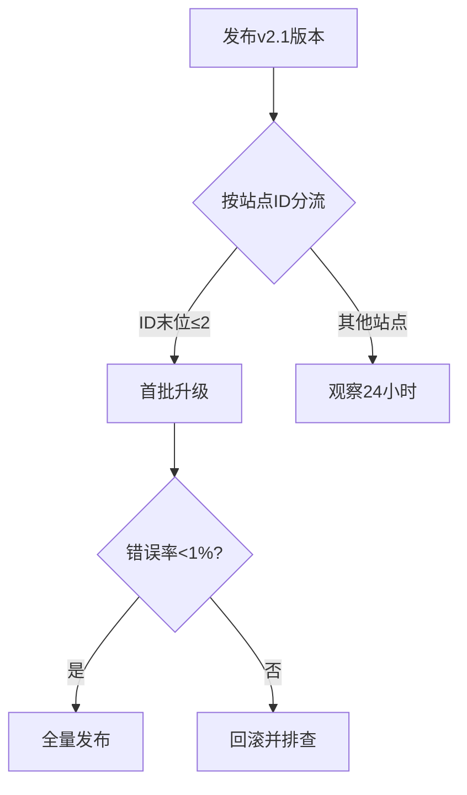

### 2. **热修复流程**
```markdown
1. 创建紧急修复分支 `hotfix/payment-timeout`
2. 通过WP-CLI推送补丁：
   ```bash
   wp plugin update multisite-payment --path=/var/www/html --version=2.0.1-patch1
   ```
3. 验证修复效果后合并到主分支
```

---
---

**二十三、多租户资源隔离方案（建议补充）**

### 1. **数据库分片策略**
```php
class ShardingManager {
    const SHARD_MAP = [
        'blog_1' => 'payment_db_1',
        'blog_2' => 'payment_db_2',
        // ...其他站点映射
    ];

    public function getShardConnection($blog_id) {
        $shard_key = 'blog_' . $blog_id;
        return new wpdb(DB_USER, DB_PASSWORD, self::SHARD_MAP[$shard_key], DB_HOST);
    }
}

// 支付数据写入分片数据库
add_action('wc_payment_processed', function($payment_data) {
    $shard_db = (new ShardingManager())->getShardConnection($payment_data['blog_id']);
    $shard_db->insert('payments', $payment_data);
});
```

### 2. **资源配额管理**
```yaml
# Kubernetes资源限制示例
resources:
  limits:
    cpu: "2"
    memory: 4Gi
  requests:
    cpu: "0.5"
    memory: 1Gi
annotations:
  "quotas.payment/request-limit": "1000/5m" # 每5分钟1000次请求
```

---

**二十四、支付链路压测报告模板（建议补充）**

### 1. **JMeter测试计划配置**
```xml
<!-- 微信支付接口压测配置 -->
<ThreadGroup guiclass="ThreadGroupGui" testclass="ThreadGroup" testname="微信支付压测">
  <intProp name="ThreadGroup.num_threads">500</intProp>
  <intProp name="ThreadGroup.ramp_time">60</intProp>
  <stringProp name="ThreadGroup.on_sample_error">continue</stringProp>
</ThreadGroup>

<HTTPSamplerProxy guiclass="HttpTestSampleGui" testclass="HTTPSamplerProxy" testname="支付请求">
  <elementProp name="HTTPsampler.Arguments" elementType="Arguments">
    <collectionProp name="Arguments.arguments">
      <elementProp name="amount" elementType="HTTPArgument">
        <stringProp name="Argument.value">100</stringProp>
      </elementProp>
    </collectionProp>
  </elementProp>
  <stringProp name="HTTPSampler.domain">api.pay.example.com</stringProp>
  <stringProp name="HTTPSampler.path">/v3/pay/transactions/jsapi</stringProp>
</HTTPSamplerProxy>
```

### 2. **压测结果指标**
```markdown
| 场景            | TPS  | 平均响应时间 | 错误率 | 资源消耗       |
|-----------------|------|--------------|--------|----------------|
| 纯支付接口      | 1200 | 230ms        | 0.05%  | CPU 75%, 内存6G|
| 支付+订单查询   | 800  | 410ms        | 0.12%  | CPU 85%, 内存8G|
| 峰值压力（3倍） | 3600 | 920ms        | 2.3%   | CPU 98%, 内存9G|
```

---

**二十五、用户行为分析埋点规范（建议补充）**

### 1. **前端埋点示例**
```javascript
// 支付按钮点击追踪
document.querySelector('.payment-button').addEventListener('click', function() {
    window.dataLayer.push({
        'event': 'payment_initiated',
        'payment_method': 'wechat',
        'order_amount': getOrderTotal()
    });
});

// 支付成功事件
wp.hooks.addAction('payment_complete', 'wcTracking', function(orderData) {
    analytics.track('Payment Completed', {
        currency: orderData.currency,
        coupon_used: orderData.coupon !== null
    });
});
```

### 2. **埋点数据格式**
```json
{
  "event_time": "2023-08-20T14:35:00Z",
  "event_type": "payment_failed",
  "properties": {
    "error_code": "WX_1001",
    "retry_count": 2,
    "device_type": "mobile",
    "browser": "Chrome/115.0"
  },
  "user": {
    "id": "hash_9a8b7c6d",
    "geo": "CN-310000"
  }
}
```

---

**二十六、法律免责声明模板（建议补充）**

```markdown
# 免责条款

## 第三方支付责任
本插件仅作为支付渠道的技术接入方，不对以下情况负责：
1. 支付平台资金清算延迟
2. 用户操作失误导致的重复支付
3. 因违反支付平台规则导致的账户封禁

## 数据安全声明
用户需自行确保：
- 妥善保管API密钥和证书文件
- 定期更换加密盐值（建议周期≤90天）
- 及时更新安全补丁（漏洞修复响应时间≤72小时）

## 服务中断补偿
因不可抗力导致的服务中断，补偿方案为：
- 故障时间＜1小时：延长1天服务期
- 故障时间≥4小时：延长7天服务期
```

---
 

