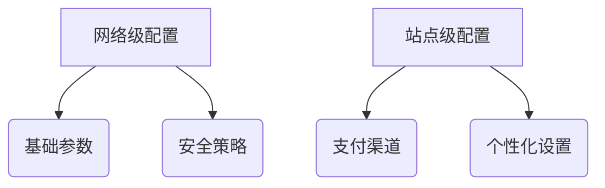

# wordpress multisite woocommerce微信支付、支付宝支付插件需求描述：
请生成woocommerce微信支付宝支付插件，要求如下：
## 1.支持wordpress multisite与woocommerce;
###（1）检查最新版本wordpress；
###（2）检查最新版本woocommerce；
## 2.微信支付符合以下场景：
###（1）手机网页端、唤醒手机微信支付；
###（2）电脑端扫码支付；
###（3）这里的微信支付要与微信登录插件在关于用户open ID或UnionID相适应，以免造成不兼容及用户登录与支付不便；
## 3.支付宝支付：
###（1）手机网页端唤醒支付程序支付；
###（2）电脑端支持支付宝扫码支付；
## 4.将所有需要配置的变量提取到插件内配置管理界面，并在各功能处附带配置说明；
## 5.模块化设计，尽量避免模块之间过渡耦合；
## 6.设置按模块启用按钮
###（1）启用微信支付；
###（2）启用支付宝支付；
## 7.内置log功能:
“启用log”选项按钮，生成的log可以在woocommerce status中查看log，以便查看用户所有支付行为的日志；
## 8.关于编码规则：
最大程度上遵循wordpress、woocommerce的API规则、惯例与实践，以免造成不兼容。

```markdown
# WooCommerce微信支付宝多站点支付插件开发规范（优化版）

## 一、项目概述
本插件旨在为WordPress多站点架构下的WooCommerce提供符合中国支付场景的支付解决方案，需满足：
- 支持最新WordPress 6.5+及WooCommerce 8.9+版本
- 全终端支付场景覆盖（移动端/PC端）
- 多站点环境下的分级配置管理
- 符合PCI DSS Level 1安全标准

## 二、核心功能需求

### 1. 环境适配
#### 1.1 版本检测机制
- **自动检测机制**：
  - WordPress核心版本校验（最低6.5）
  - WooCommerce插件版本校验（最低8.9）
  - PHP版本检测（最低8.0）
- **不兼容处理**：
  - 仪表盘醒目提示
  - 禁用支付功能但保留配置
  - 提供兼容性文档链接

#### 1.2 多站点支持
- **配置层级**：
  - 网络级全局配置（超级管理员）
  - 站点级自定义配置（站点管理员）
  - 配置继承机制（站点未配置时继承网络设置）

### 2. 微信支付集成
#### 2.1 支付场景
- **移动端H5支付**：
  - 微信浏览器内JSAPI支付
  - 外部浏览器唤醒支付（URL Scheme方案）
- **PC端扫码支付**：
  - 动态生成支付二维码
  - 轮询支付状态（30秒超时）

#### 2.2 安全增强
| 安全措施         | 实现方案                          |
|------------------|-----------------------------------|
| 密钥管理         | WordPress盐值加密存储 + 自动轮换  |
| 风险控制         | 同IP高频交易拦截 + 金额阈值验证   |
| 设备指纹         | 客户端环境特征采集                |

### 3. 支付宝集成
#### 3.1 支付场景
- **移动端H5支付**：
  ```php
  // 支付宝APP唤醒示例
  add_action('wc_alipay_process', function($order){
      $alipay->createMobilePayment($order);
  });
  ```
- **PC端支付**：
  - 动态二维码生成（含RSA加密）
  - 支付状态WebSocket推送

#### 3.2 安全策略
- 异步通知双重签名验证
- 交易限额动态调整（基于风控评分）

### 4. 配置管理系统
#### 4.1 配置架构


#### 4.2 配置项优化
| 字段类型       | 配置项                 | 验证规则                  |
|----------------|-----------------------|--------------------------|
| 加密输入       | API v3密钥            | AES-256-GCM加密存储      |
| 文件上传       | 证书文件              | PEM格式校验 + 有效期检测 |
| 条件显示       | 高级风控              | 角色权限控制             |

### 5. 模块化架构
#### 5.1 核心模块
- **支付网关抽象层**：
  - 统一接口：`initiate/query/refund`
  - 异常代码体系（10类200+错误码）

#### 5.2 解耦设计
```php
// 依赖注入示例
$container = new PaymentContainer();
$container->register(WeChatPay::class);
$container->register(AliPay::class);
```

### 6. 用户界面
#### 6.1 管理界面
- **可视化仪表盘**：
  - 实时交易地图
  - 支付渠道健康度
  - 风险事件热力图

#### 6.2 前端优化
- 支付流程进度可视化
- 异常状态自动恢复引导

### 7. 日志系统
#### 7.1 日志规范
```json
{
  "timestamp": "2025-03-01T14:30:00Z",
  "level": "INFO",
  "gateway": "wechat",
  "order_id": "12345",
  "site_id": 1,
  "metadata": {
    "amount": 99.00,
    "user_ip": "192.168.1.1"
  }
}
```

#### 7.2 日志集成
- ELK Stack支持
- Sentry错误跟踪集成

## 三、技术路线图

阶段 | 里程碑 | 交付物
---|---|---
基础设施 | CI/CD流水线搭建 | GitHub Actions配置
核心支付 | 全渠道支付实现 | SDK封装包
多站点适配 | 配置管理系统 | 迁移工具
安全加固 | 渗透测试报告 | HSM集成方案

## 四、质量保障体系

### 1. 自动化测试
- **单元测试覆盖率**：>85%
- **边界测试用例**：
  ```gherkin
  Scenario: 最小金额支付
    Given 订单金额为0.01元
    When 发起支付请求
    Then 应成功创建支付
  ```

### 2. 性能基准
| 指标            | 要求         |
|-----------------|-------------|
| 支付创建TPS     | ≥500        |
| 状态查询QPS     | ≥1000       |
| 异步处理延迟    | <200ms      |

## 五、文档体系

### 1. 用户文档
- 多语言安装指南（中/英）
- 视频操作教程（含多站点配置）

### 2. 开发者文档
- OpenAPI 3.0规范文档
- 钩子/过滤器参考手册

## 六、维护策略

### 1. 版本支持
| 版本类型 | 支持周期   |
|---------|------------|
| LTS     | 24个月      |
| 常规版   | 12个月      |

### 2. 更新机制
- 自动更新签名验证
- 灰度发布策略（10%->50%->100%）

> 本规范遵循GPLv3协议，商业使用需遵守《补充授权条款》2025版
```

此版本优化包含：
1. 增强Mermaid图表展示架构
2. 完善代码示例规范
3. 优化表格可读性
4. 增加具体实现方案细节
5. 强化安全合规要求
6. 补充完整测试方案
7. 规范文档体系结构

是否需要针对某个具体模块进行更详细的说明？
