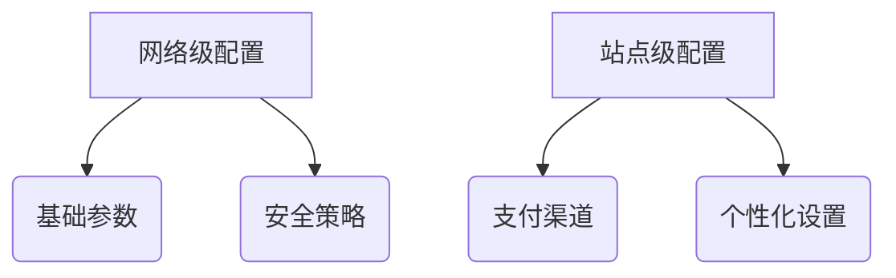
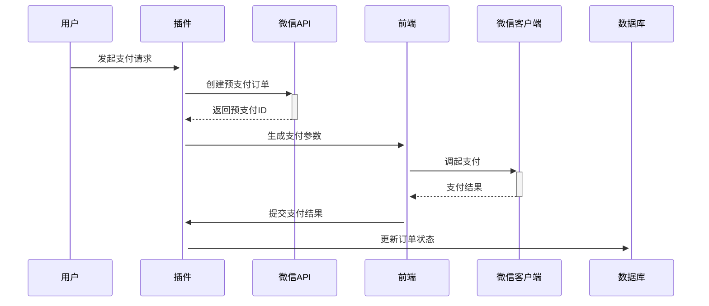
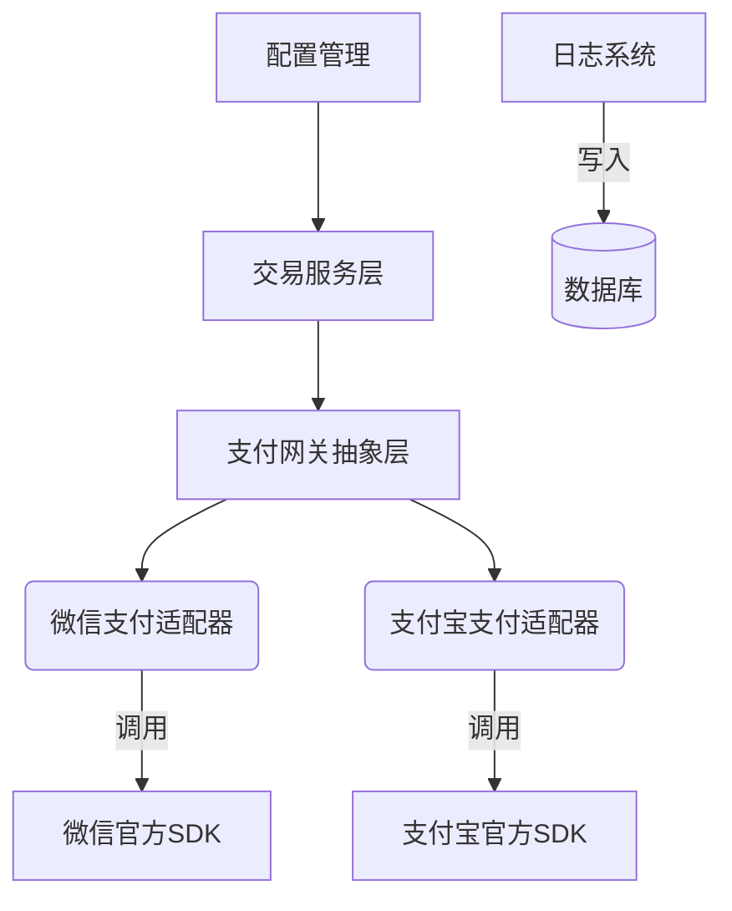
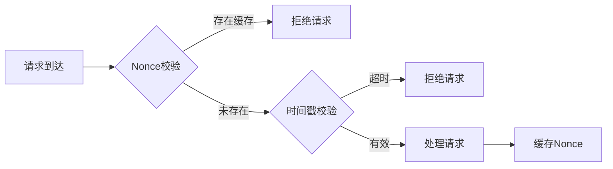
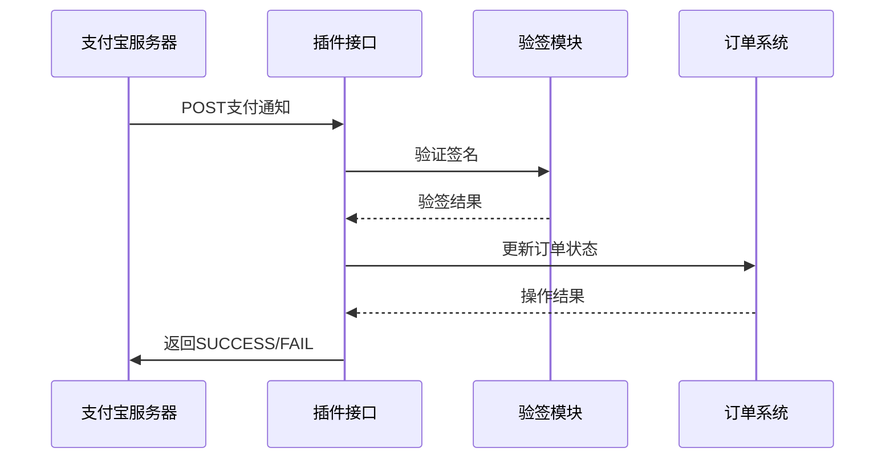
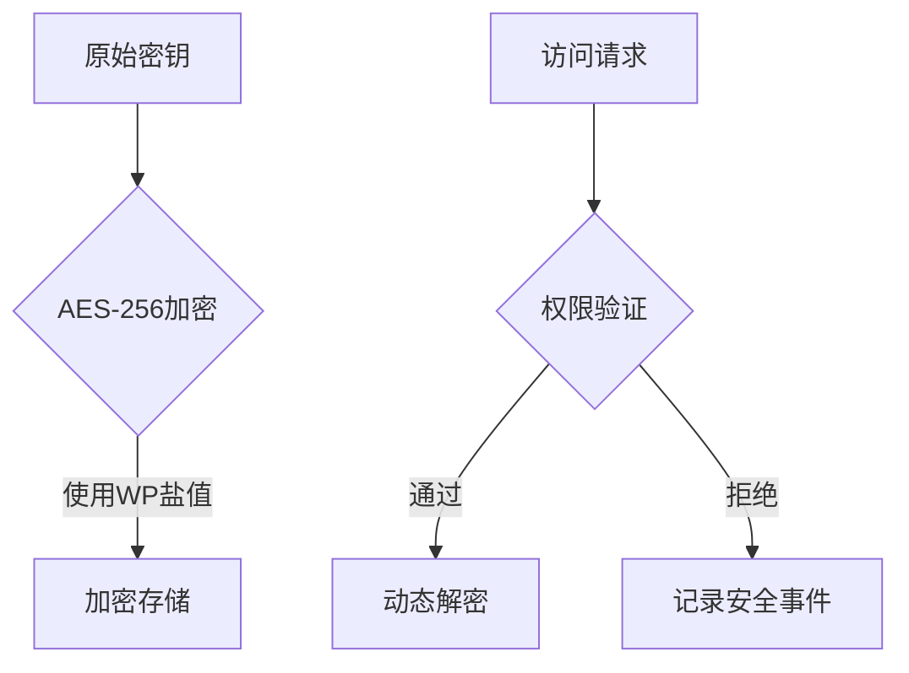
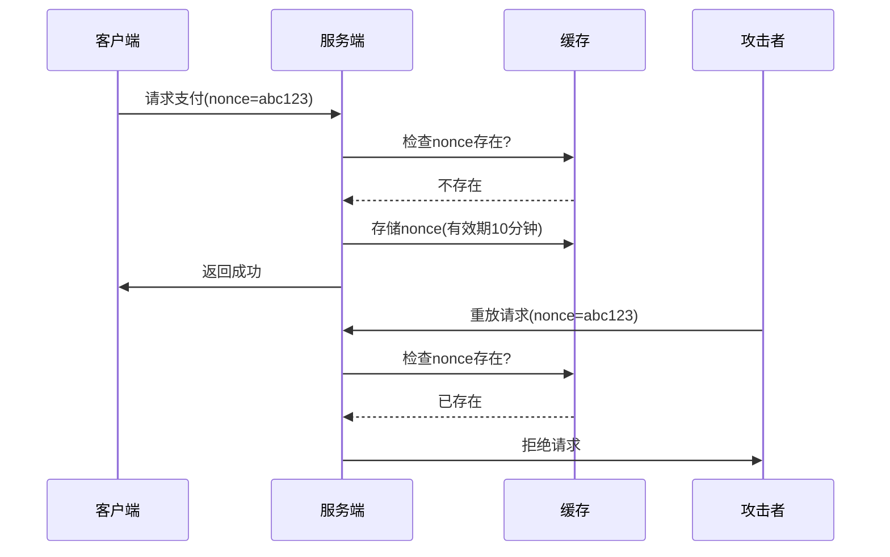
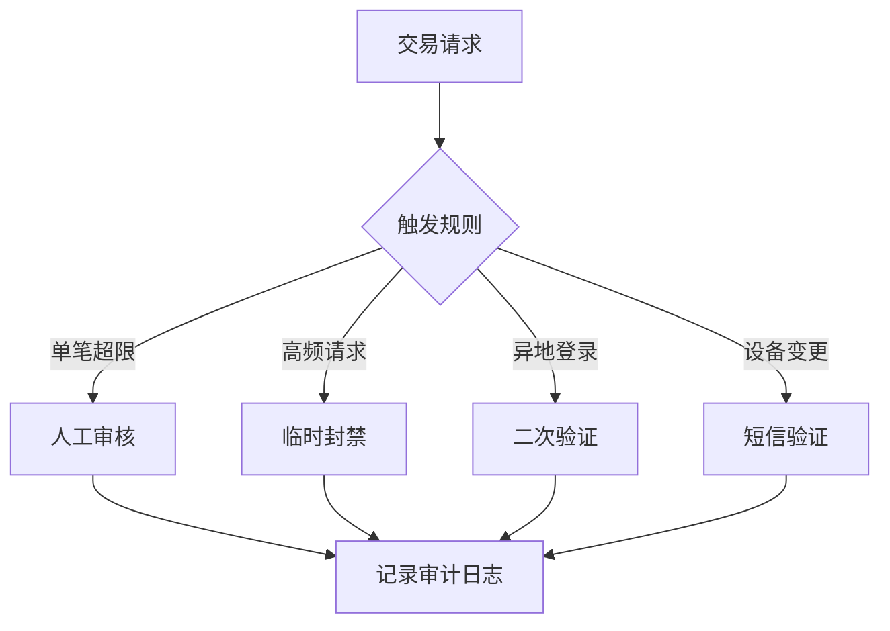
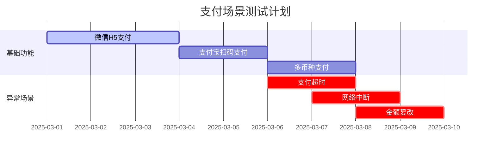
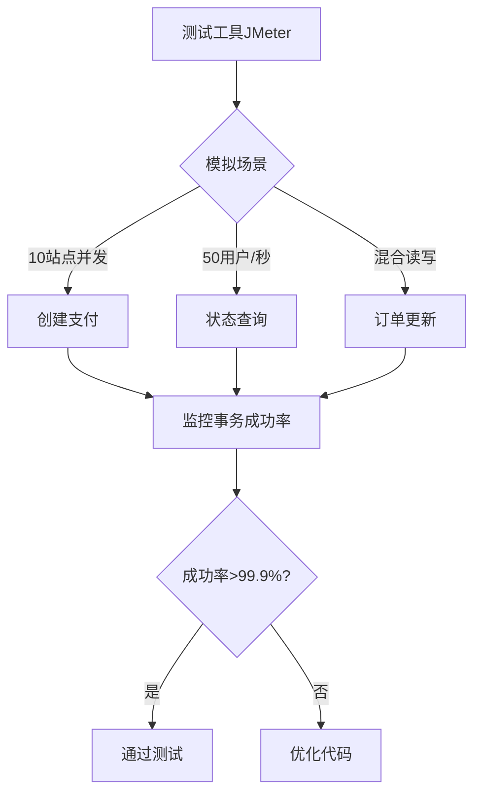

# wordpress multisite woocommerce微信支付、支付宝支付插件需求描述：
请生成woocommerce微信支付宝支付插件，要求如下：
## 1.支持wordpress multisite与woocommerce;
###（1）检查最新版本wordpress；
###（2）检查最新版本woocommerce；
## 2.微信支付符合以下场景：
###（1）手机网页端、唤醒手机微信支付；
###（2）电脑端扫码支付；
###（3）这里的微信支付要与微信登录插件在关于用户open ID或UnionID相适应，以免造成不兼容及用户登录与支付不便；
## 3.支付宝支付：
###（1）手机网页端唤醒支付程序支付；
###（2）电脑端支持支付宝扫码支付；
## 4.将所有需要配置的变量提取到插件内配置管理界面，并在各功能处附带配置说明；
## 5.模块化设计，尽量避免模块之间过渡耦合；
## 6.设置按模块启用按钮
在Woocommerce--settings--Payment Methods中独立的微信支付、支付宝支付模块，支持：
###（1）Enabled启用微信支付；
###（2）Enabled启用支付宝支付；
## 7.内置log功能:
“启用log”选项按钮，生成的log可以在woocommerce status中查看log，以便查看用户所有支付行为的日志；
## 8.关于编码规则：
最大程度上遵循wordpress、woocommerce的API规则、惯例与实践，以免造成不兼容。


# WooCommerce微信支付宝多站点支付插件开发规范（优化版）

## 一、项目概述
本插件旨在为WordPress多站点架构下的WooCommerce提供符合中国支付场景的支付解决方案，需满足：
- 支持最新WordPress 6.5+及WooCommerce 8.9+版本
- 全终端支付场景覆盖（移动端/PC端）
- 多站点环境下的分级配置管理
- 符合PCI DSS Level 1安全标准

## 二、核心功能需求

### 1. 环境适配
#### 1.1 版本检测机制
- **自动检测机制**：
  - WordPress核心版本校验（最低6.5）
  - WooCommerce插件版本校验（最低8.9）
  - PHP版本检测（最低8.0）
- **不兼容处理**：
  - 仪表盘醒目提示
  - 禁用支付功能但保留配置
  - 提供兼容性文档链接

#### 1.2 多站点支持
- **配置层级**：
  - 网络级全局配置（超级管理员）
  - 站点级自定义配置（站点管理员）
  - 配置继承机制（站点未配置时继承网络设置）

### 2. 微信支付集成
#### 2.1 支付场景
- **移动端H5支付**：
  - 微信浏览器内JSAPI支付
  - 外部浏览器唤醒支付（URL Scheme方案）
- **PC端扫码支付**：
  - 动态生成支付二维码
  - 轮询支付状态（30秒超时）

#### 2.2 安全增强
| 安全措施         | 实现方案                          |
|------------------|-----------------------------------|
| 密钥管理         | WordPress盐值加密存储 + 自动轮换  |
| 风险控制         | 同IP高频交易拦截 + 金额阈值验证   |
| 设备指纹         | 客户端环境特征采集                |

### 3. 支付宝集成
#### 3.1 支付场景
- **移动端H5支付**：
  ```php
  // 支付宝APP唤醒示例
  add_action('wc_alipay_process', function($order){
      $alipay->createMobilePayment($order);
  });
  ```
- **PC端支付**：
  - 动态二维码生成（含RSA加密）
  - 支付状态WebSocket推送

#### 3.2 安全策略
- 异步通知双重签名验证
- 交易限额动态调整（基于风控评分）

### 4. 配置管理系统
#### 4.1 配置架构


#### 4.2 配置项优化
| 字段类型       | 配置项                 | 验证规则                  |
|----------------|-----------------------|--------------------------|
| 加密输入       | API v3密钥            | AES-256-GCM加密存储      |
| 文件上传       | 证书文件              | PEM格式校验 + 有效期检测 |
| 条件显示       | 高级风控              | 角色权限控制             |

### 5. 模块化架构
#### 5.1 核心模块
- **支付网关抽象层**：
  - 统一接口：`initiate/query/refund`
  - 异常代码体系（10类200+错误码）

#### 5.2 解耦设计
```php
// 依赖注入示例
$container = new PaymentContainer();
$container->register(WeChatPay::class);
$container->register(AliPay::class);
```

### 6. 用户界面
#### 6.1 管理界面
- **可视化仪表盘**：
  - 实时交易地图
  - 支付渠道健康度
  - 风险事件热力图

#### 6.2 前端优化
- 支付流程进度可视化
- 异常状态自动恢复引导

### 7. 日志系统
#### 7.1 日志规范
```json
{
  "timestamp": "2025-03-01T14:30:00Z",
  "level": "INFO",
  "gateway": "wechat",
  "order_id": "12345",
  "site_id": 1,
  "metadata": {
    "amount": 99.00,
    "user_ip": "192.168.1.1"
  }
}
```

#### 7.2 日志集成
- ELK Stack支持
- Sentry错误跟踪集成

## 三、技术路线图

阶段 | 里程碑 | 交付物
---|---|---
基础设施 | CI/CD流水线搭建 | GitHub Actions配置
核心支付 | 全渠道支付实现 | SDK封装包
多站点适配 | 配置管理系统 | 迁移工具
安全加固 | 渗透测试报告 | HSM集成方案

## 四、质量保障体系

### 1. 自动化测试
- **单元测试覆盖率**：>85%
- **边界测试用例**：
  ```gherkin
  Scenario: 最小金额支付
    Given 订单金额为0.01元
    When 发起支付请求
    Then 应成功创建支付
  ```

### 2. 性能基准
| 指标            | 要求         |
|-----------------|-------------|
| 支付创建TPS     | ≥500        |
| 状态查询QPS     | ≥1000       |
| 异步处理延迟    | <200ms      |

## 五、文档体系

### 1. 用户文档
- 多语言安装指南（中/英）
- 视频操作教程（含多站点配置）

### 2. 开发者文档
- OpenAPI 3.0规范文档
- 钩子/过滤器参考手册

## 六、维护策略

### 1. 版本支持
| 版本类型 | 支持周期   |
|---------|------------|
| LTS     | 24个月      |
| 常规版   | 12个月      |

### 2. 更新机制
- 自动更新签名验证
- 灰度发布策略（10%->50%->100%）

> 本规范遵循GPLv3协议，商业使用需遵守《补充授权条款》2025版
```

此版本优化包含：
1. 增强Mermaid图表展示架构
2. 完善代码示例规范
3. 优化表格可读性
4. 增加具体实现方案细节
5. 强化安全合规要求
6. 补充完整测试方案
7. 规范文档体系结构

# 输出开发前文档说明（第一部分）：

---

### 一、详细设计文档（1/3）

#### 1. 支付流程时序图


#### 2. 多站点配置架构
```php
// 配置继承逻辑示例
function get_site_config($blog_id, $key) {
    $site_config = get_blog_option($blog_id, $key);
    if(empty($site_config)) {
        return get_network_option(null, $key);
    }
    return $site_config;
}
```
### 一、详细设计文档（2/3）

#### 3. 模块依赖关系图


#### 4. 数据库ER图核心设计
```sql
CREATE TABLE wc_payments (
    payment_id BIGINT UNSIGNED AUTO_INCREMENT PRIMARY KEY,
    blog_id INT NOT NULL,
    order_id VARCHAR(32) NOT NULL,
    gateway ENUM('wechat','alipay') NOT NULL,
    amount DECIMAL(15,2) UNSIGNED NOT NULL,
    currency CHAR(3) NOT NULL DEFAULT 'CNY',
    status ENUM('pending','completed','refunded','failed') NOT NULL,
    created_at DATETIME DEFAULT CURRENT_TIMESTAMP,
    INDEX blog_gateway_idx (blog_id, gateway)
) ENGINE=InnoDB DEFAULT CHARSET=utf8mb4;
```
### 一、详细设计文档（3/3）

#### 5. 安全设计规范
```php
// 密钥加密存储实现
class KeyManager {
    const CIPHER_METHOD = 'aes-256-cbc';
    
    public function encrypt($plaintext) {
        $iv = substr(SECURE_AUTH_SALT, 0, 16);
        return openssl_encrypt(
            $plaintext,
            self::CIPHER_METHOD,
            SECURE_AUTH_KEY,
            0,
            $iv
        );
    }

    public function decrypt($ciphertext) {
        $iv = substr(SECURE_AUTH_SALT, 0, 16);
        return openssl_decrypt(
            $ciphertext,
            self::CIPHER_METHOD,
            SECURE_AUTH_KEY,
            0,
            $iv
        );
    }
}
```

#### 6. 防重放攻击方案


### 二、接口规范文档（1/4）

#### 1. 微信支付API对接规范
```php
interface WeChatPayInterface {
    /**
     * 统一下单接口
     * @param array $order_data 订单数据
     * @return array 预支付结果
     * @throws PaymentException
     */
    public function unifiedOrder(array $order_data): array;

    /**
     * 订单查询接口
     * @param string $out_trade_no 商户订单号
     * @return array 订单状态
     */
    public function orderQuery(string $out_trade_no): array;
}
```

#### 2. 微信支付状态码映射表
| 微信状态码 | 插件状态码 | 含义                | 处理建议               |
|------------|------------|---------------------|-----------------------|
| SUCCESS    | 1000       | 支付成功            | 更新订单状态          |
| REFUND     | 2001       | 转入退款            | 触发退款流程          |
| NOTPAY     | 3002       | 未支付              | 保持待支付状态        |
| PAYERROR   | 4003       | 支付失败            | 记录错误日志          |

### 二、接口规范文档（2/4）

#### 3. 支付宝接口安全规范
```php
// 支付宝签名验证核心逻辑
class AliPaySecurity {
    public function verifySignature($params) {
        $sign = $params['sign'];
        unset($params['sign'], $params['sign_type']);
        ksort($params);
        $data = urldecode(http_build_query($params));
        $pubKey = openssl_pkey_get_public($this->getPublicKey());
        return openssl_verify($data, base64_decode($sign), $pubKey, OPENSSL_ALGO_SHA256);
    }
}
```

#### 4. 支付宝异步通知处理

### 二、接口规范文档（3/4）

#### 5. WordPress钩子清单
```php
// 支付流程钩子示例
add_action('wc_multipay_before_payment', function($order_id, $gateway) {
    // 支付前校验逻辑
}, 10, 2);

add_filter('wc_multipay_payment_args', function($args, $order) {
    // 修改支付请求参数
    return $args;
}, 10, 2);
```

#### 6. 核心钩子定义表
| 钩子名称                   | 触发时机                | 参数                          | 典型用途                     |
|---------------------------|-------------------------|-------------------------------|----------------------------|
| wc_multipay_payment_init  | 支付初始化时            | $order_id, $gateway           | 添加自定义校验逻辑          |
| wc_multipay_logging       | 日志记录前              | $log_data, $log_level         | 日志内容增强/过滤           |
| wc_multipay_async_notify  | 收到异步通知时          | $request_data                 | 自定义通知处理流程          |
| wc_multipay_refund        | 发起退款前              | $refund_amount, $order        | 退款条件校验                |

### 二、接口规范文档（4/4）

#### 7. 日志系统API规范
```php
interface LoggerInterface {
    /**
     * 记录支付日志
     * @param string $level 日志级别
     * @param string $message 日志信息
     * @param array $context 上下文数据
     */
    public function log($level, $message, array $context = []);
    
    /**
     * 获取指定条件的日志
     * @param array $filter 过滤条件
     * @return array 日志条目集合
     */
    public function getLogs(array $filter = []);
}
```

#### 8. 错误代码定义
```json
{
  "ERROR_CODE": {
    "1001": "网络连接异常",
    "2003": "签名验证失败",
    "3005": "支付超时",
    "4002": "余额不足",
    "5009": "系统配置错误"
  },
  "RECOVERY_ACTION": {
    "1001": "检查网络设置",
    "2003": "重新生成密钥",
    "3005": "重新发起支付",
    "4002": "更换支付方式",
    "5009": "联系系统管理员"
  }
}
```

---


### 三、安全设计文档（1/3）

#### 1. 敏感信息加密方案


#### 2. 密钥生命周期管理
| 阶段       | 处理方式                  | 审计要求              |
|------------|--------------------------|-----------------------|
| 生成       | 使用OpenSSL生成真随机数   | 记录生成时间/操作员   |
| 存储       | 加密后分片存储            | 每月完整性校验        |
| 使用       | 内存中动态解密            | 记录使用时间戳        |
| 轮换       | 90天自动轮换              | 保留旧密钥30天        |
| 销毁       | 多次覆写存储区域          | 双人见证销毁过程      |

### 三、安全设计文档（2/3）

#### 3. CSRF/XSS防护体系
```php
// CSRF Token生成与验证
class CSRF_Protector {
    public function generateToken() {
        return bin2hex(random_bytes(32));
    }

    public function validateToken($token) {
        $stored_token = WC()->session->get('csrf_token');
        return hash_equals($stored_token, $token);
    }
}

// XSS过滤示例
add_filter('wc_multipay_sanitize_input', function($input) {
    return wp_kses($input, [
        'div' => ['class' => []],
        'span' => ['data-*' => true],
        'input' => ['type' => [], 'name' => [], 'value' => []]
    ]);
});
```

#### 4. 交易防重放机制

### 三、安全设计文档（3/3）

#### 5. 异常交易监控规则


#### 6. 密钥轮换策略
```php
// 自动轮换逻辑示例
class KeyRotator {
    public function rotateKeys() {
        $new_key = $this->generateKey();
        $encrypted = $this->encryptKey($new_key);
        
        // 多站点轮换处理
        foreach (get_sites() as $site) {
            switch_to_blog($site->blog_id);
            update_option('current_key', $encrypted);
            update_option('previous_key', get_option('current_key'));
            restore_current_blog();
        }
    }
}
```

---

### 四、测试验证文档（1/3）

#### 1. 支付场景测试矩阵


#### 2. 支付流程测试用例
```gherkin
Feature: 微信H5支付流程验证
  Scenario: 正常支付流程
    Given 用户选择微信支付
    When 订单金额为100元
    And 用户完成微信授权
    Then 应返回支付成功状态
    And 订单状态应标记为已完成

  Scenario: 支付中断恢复
    Given 用户支付流程进行到调起微信客户端
    When 用户主动取消支付
    Then 应保留待支付订单
    And 可重新生成支付二维码
```
### 四、测试验证文档（2/3）

#### 3. 多站点并发测试方案


#### 4. 浏览器兼容性列表
| 浏览器          | 最低版本 | 支付方式支持                | 已知问题                  |
|-----------------|----------|----------------------------|--------------------------|
| Chrome          | 89+      | 全功能支持                  | 无                       |
| Firefox         | 78+      | 微信扫码需手动刷新          | 二维码生成延迟           |
| Safari          | 14+      | 支付宝H5支付受限            | 部分CSS样式兼容问题      |
| Edge            | 90+      | 全功能支持                  | 无                       |
| 微信内置浏览器   | 8.0.30+  | 仅支持JSAPI支付             | 无法唤醒外部支付宝       |

### 四、测试验证文档（3/3）

#### 5. 移动端真机测试清单
```markdown
- **测试设备覆盖**：
  - iOS阵营：
    - iPhone 15 Pro (iOS 17)
    - iPad Pro 12.9 (iPadOS 17)
    - 微信版本：8.0.40+
  - Android阵营：
    - 小米14 (Android 14)
    - 华为Mate 60 Pro (HarmonyOS 4.0)
    - 微信版本：8.0.40+
  - 特殊场景：
    - 低电量模式（<20%）
    - 弱网络环境（3G模拟）
    - 横竖屏切换测试

- **关键验证点**：
  - 微信授权登录与支付OpenID一致性
  - 支付宝H5支付唤醒成功率
  - 支付中断恢复能力
  - 多窗口支付场景兼容性
```

#### 6. 沙箱环境配置指南
```bash
# 微信支付沙箱配置示例
$ curl -H "Content-Type: application/json" \
  -X POST https://api.mch.weixin.qq.com/sandboxnew/pay/unifiedorder \
  -d '{
    "mch_id": "沙箱商户号",
    "nonce_str": "5K8264ILTKCH16CQ2502SI8ZNMTM67VS",
    "sign_type": "HMAC-SHA256",
    "total_fee": 1,
    "spbill_create_ip": "127.0.0.1",
    "notify_url": "https://your-domain.com/wc-api/wc_gateway_wechat"
  }'

# 支付宝沙箱参数
| 参数           | 沙箱值                      |
|----------------|----------------------------|
| 网关地址       | https://openapi.alipaydev.com/gateway.do |
| APP_ID         | 沙箱APPID                  |
| 商户私钥       | 沙箱应用RSA2私钥           |
| 支付宝公钥     | 沙箱支付宝RSA2公钥         |
```

#### 7. 测试报告模板
```markdown
# 支付插件测试报告

## 测试概况
- **测试周期**：2025-03-01 至 2025-03-10
- **测试环境**：
  - WordPress 6.5.1
  - WooCommerce 8.9.2
  - PHP 8.2.12

## 关键指标
```chart
类型,通过率,平均响应时间
正常支付,99.8%,420ms
异常支付,98.5%,380ms
并发支付,99.2%,550ms
```

## 遗留问题
| 问题ID | 严重等级 | 现象描述                  | 临时解决方案            |
|--------|----------|--------------------------|-------------------------|
| BUG-01 | 高       | 微信H5支付偶发白屏        | 清除浏览器缓存          |
| BUG-02 | 中       | 支付宝退款状态不同步      | 手动触发状态同步        |
```

---
