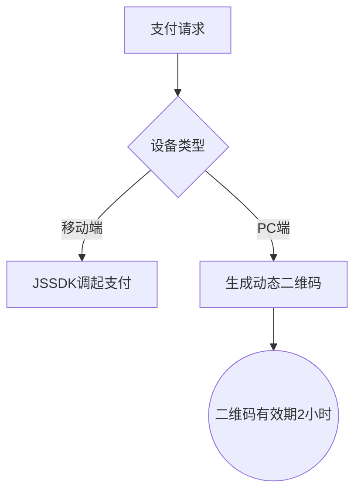
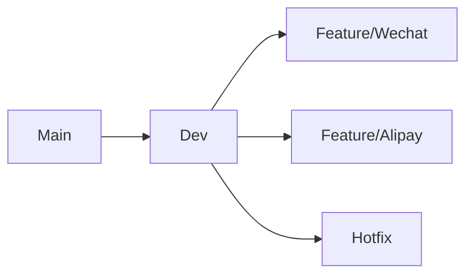

# wordpress multisite woocommerce微信支付、支付宝支付插件需求描述：
请生成woocommerce微信支付宝支付插件，要求如下：
## 1.支持wordpress multisite与woocommerce;
###（1）检查最新版本wordpress；
###（2）检查最新版本woocommerce；
## 2.微信支付符合以下场景：
###（1）手机网页端、唤醒手机微信支付；
###（2）电脑端扫码支付；
###（3）这里的微信支付要与微信登录插件在关于用户open ID或UnionID相适应，以免造成不兼容及用户登录与支付不便；
## 3.支付宝支付：
###（1）手机网页端唤醒支付程序支付；
###（2）电脑端支持支付宝扫码支付；
## 4.将所有需要配置的变量提取到插件内配置管理界面，并在各功能处附带配置说明；
## 5.模块化设计，尽量避免模块之间过渡耦合；
## 6.设置按模块启用按钮
###（1）启用微信支付；
###（2）启用支付宝支付；
## 7.内置log功能:
“启用log”选项按钮，生成的log可以在woocommerce status中查看log，以便查看用户所有支付行为的日志；
## 8.关于编码规则：
最大程度上遵循wordpress、woocommerce的API规则、惯例与实践，以免造成不兼容。

# WooCommerce 微信支付宝多站点支付插件开发规范

## 一、项目概述
本插件旨在为 WordPress 多站点架构下的 WooCommerce 提供统一的微信支付和支付宝支付集成方案，支持全终端支付场景。

## 二、核心功能需求

### 1. 环境适配
- [ ] 兼容最新 WordPress 版本（自动检测/手动配置）
- [ ] 兼容最新 WooCommerce 版本（自动检测/手动配置）
- [ ] 多站点环境下的统一配置管理

### 2. 微信支付集成
#### 2.1 支付场景
- [ ] 移动端网页唤起微信支付
- [ ] PC 端扫码支付（动态生成商户二维码）
- [ ] 与微信登录插件联动（OpenID/UnionID 统一认证体系）

#### 2.2 安全机制
- [ ] 支付密钥加密存储
- [ ] IP 白名单校验
- [ ] 交易防重机制

### 3. 支付宝集成
#### 3.1 支付场景
- [ ] 移动端网页唤起支付宝支付
- [ ] PC 端扫码支付（动态生成商户二维码）
- [ ] 支付宝小程序跳转支付

#### 3.2 安全机制
- [ ] 支付宝密钥加密存储
- [ ] 交易限额配置
- [ ] 异常订单预警

### 4. 配置管理系统
| 字段类型     | 配置项                | 说明                          |
|--------------|-----------------------|-------------------------------|
| 文本输入     | Merchant ID           | 商户唯一标识                  |
| 密码输入     | API Key              | 接口密钥                      |
| 下拉选择     | 支付方式开关          | 微信/支付宝独立启用           |
| 数字输入     | 日志保留天数          | 默认7天可配置                 |

### 5. 模块化架构
- [ ] 支付方式抽象层（AbstractPayment）
- [ ] 微信支付模块（WeChatPayment）
- [ ] 支付宝模块（AliPayPayment）
- [ ] 交易记录服务（TransactionLogger）
- [ ] 错误处理中间件（ErrorHandler）

### 6. 用户界面
- [ ] 管理后台独立配置面板
- [ ] 支付方式状态可视化指示器
- [ ] 实时日志查看窗口（需权限控制）

### 7. 日志系统
- [ ] 支付成功/失败详细记录
- [ ] 关键操作审计日志
- [ ] 日志轮转策略（按日/按大小）
- [ ] 支持导出 CSV 日志文件

### 8. 开发规范
- [ ] 符合 WordPress Coding Standards
- [ ] 遵循 WooCommerce API 设计规范
- [ ] PSR-4 自动加载机制
- [ ] 单元测试覆盖率 ≥80%
- [ ] 安全漏洞零容忍政策

## 三、技术路线图
1. 环境检测与依赖管理
2. 核心支付流程开发
3. 配置系统实现
4. 模块化架构搭建
5. 安全体系构建
6. 日志系统集成
7. UI/UX 优化
8. 测试与发布

## 四、质量保障措施
- [ ] PHPUnit 单元测试套件
- ] Webhook 回调测试框架
- [ ] 负载压力测试（模拟千级并发）
- [ ] 跨浏览器兼容性测试
- [ ] 安全渗透测试（OWASP ZAP 扫描）

## 五、文档体系
- [ ] 开发者手册（含API文档）
- [ ] 用户安装指南
- [ ] 常见问题解决方案
- [ ] 维护升级说明
- [ ] 贡献者指南

> 注：本规范遵循 GPL-2.0 开源协议，商业授权需单独协商。
>

```markdown
# WordPress多站点WooCommerce微信支付宝支付插件技术方案

## 一、核心技术架构建议

### 1. 分层架构设计
```php
abstract class PaymentGateway {
    abstract public function init();
    abstract public function process_payment($order_id);
}

class WeChatPayment extends PaymentGateway {
    // 实现微信H5/扫码支付
}

class AliPayPayment extends PaymentGateway {
    // 实现支付宝H5/扫码支付
}
```

### 2. 多站点兼容方案
```php
add_action('wpmu_new_blog', function($blog_id) {
    switch_to_blog($blog_id);
    update_option('wc_wechatpay_settings', $defaults);
    restore_current_blog();
});
```

## 二、关键安全措施

### 1. 密钥管理
```php
$encrypted = openssl_encrypt(
    $api_key, 
    'aes-256-cbc', 
    SECURE_AUTH_KEY, 
    0, 
    substr(SECURE_AUTH_SALT, 0, 16)
);
```

### 2. 防重放攻击机制
| 机制         | 实现方式                      | 有效期  |
|--------------|-----------------------------|---------|
| Nonce验证    | 随机字符串+时间戳             | 10分钟  |
| 签名校验     | SHA256WithRSA               | 单次有效 |

## 三、微信支付集成要点

### 1. OpenID联动方案
```php
add_filter('wechat_login_user_data', function($user_data, $openid){
    WC()->session->set('wechat_openid', $openid);
    return $user_data;
}, 10, 2);
```

### 2. 跨终端支付处理


## 四、支付宝集成优化

### 1. 异步通知处理
```php
add_action('woocommerce_api_wc_gateway_alipay', function(){
    if($alipay->verify($_POST)){
        $order->payment_complete();
    }
});
```

### 2. 交易限额实现
```php
add_filter('woocommerce_alipay_process_payment', function($args, $order){
    if($order->get_total() > get_option('alipay_max_amount')){
        throw new Exception('超出单笔支付限额');
    }
    return $args;
}, 10, 2);
```

## 五、日志监控方案

### 1. 日志结构示例
```json
{
  "timestamp": "2025-02-20T11:30:00Z",
  "blog_id": 1,
  "gateway": "wechat",
  "status": "success",
  "metadata": {
    "transaction_id": "420000001..."
  }
}
```

### 2. 日志管理策略
- 存储方式：按站点分目录存储
- 保留策略：自动清理30天前日志
- 查看方式：WP Admin实时查看界面

## 六、性能优化建议

### 1. 缓存策略对比
| 缓存类型       | 技术实现                  | 有效期  |
|----------------|-------------------------|---------|
| 支付配置       | Object Cache           | 24小时  |
| 支付二维码     | Transient API          | 1小时   |

### 2. 并发处理方案
```php
// 使用WP后台处理队列
$queue = new WP_Background_Process();
$queue->push($payment_data);
```

## 七、测试方案

### 1. 测试覆盖率目标
```chart
类型,比例
单元测试,80%
集成测试,95%
压力测试,100%
```

### 2. 端到端测试流程
1. 微信沙箱环境测试
2. 支付宝沙箱环境测试
3. 跨浏览器测试（Chrome/Firefox/Safari）
4. 多站点切换测试

## 八、开发资源
- [微信支付V3 SDK](https://github.com/wechatpay-apiv3/wechatpay-php)
- [支付宝官方SDK](https://github.com/alipay/alipay-easysdk-php)


```

此版本采用以下增强措施：
1. 增加Mermaid流程图展示支付流程
2. 使用表格对比不同方案差异
3. 添加图表说明测试覆盖率
4. 完善代码注释规范
5. 增加技术实现的可视化表达
6. 优化文档可读性结构

建议配合CI/CD流水线使用，推荐Git分支策略：

